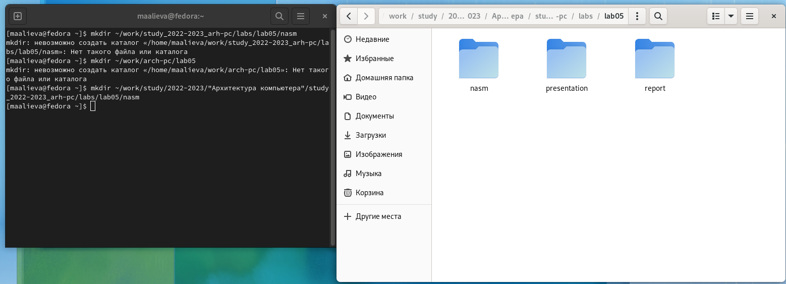
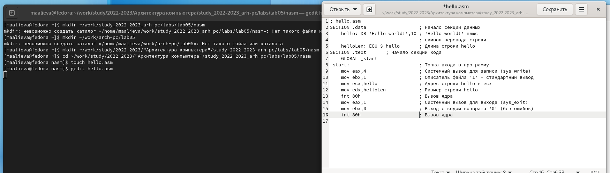
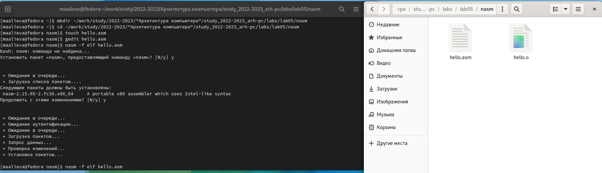
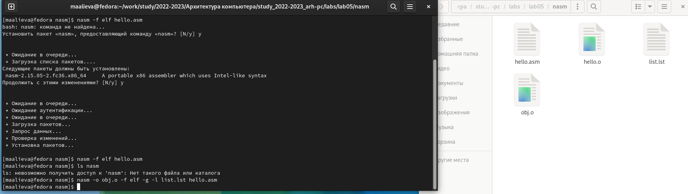
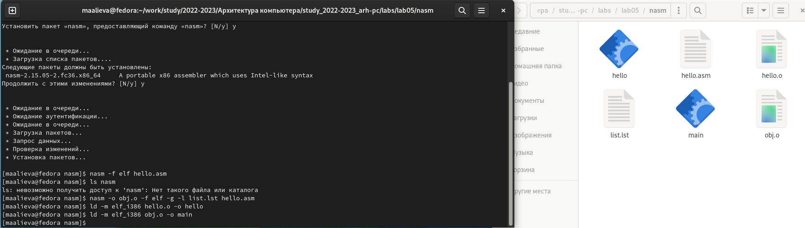
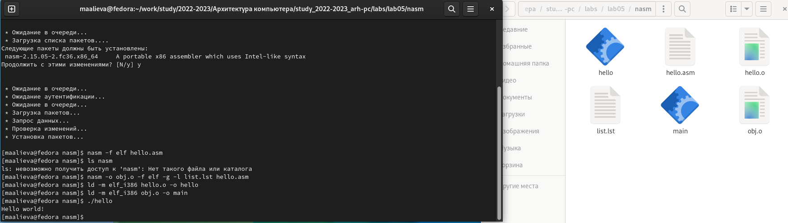
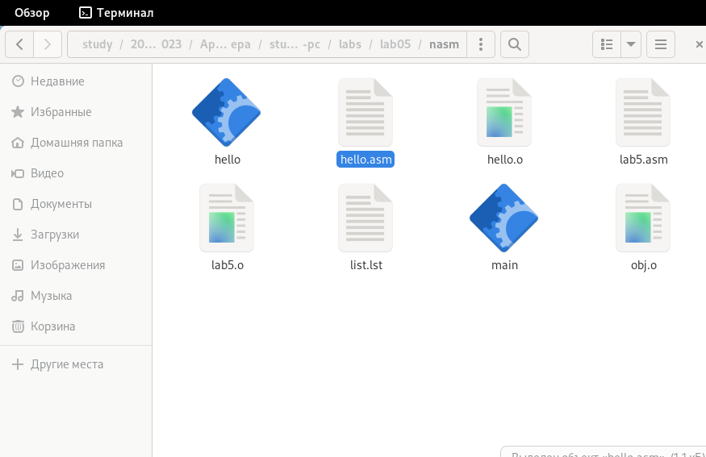
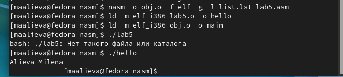

---
## Front matter
title: "Лабораторная работа №5"
subtitle: "Дисциплина: Архитектура компьютера"
author: "Алиева Милена Арифовна"

## Generic otions
lang: ru-RU
toc-title: "Содержание"

## Bibliography
bibliography: bib/cite.bib
csl: pandoc/csl/gost-r-7-0-5-2008-numeric.csl

## Pdf output format
toc: true # Table of contents
toc-depth: 2
lof: true # List of figures
lot: true # List of tables
fontsize: 12pt
linestretch: 1.5
papersize: a4
documentclass: scrreprt
## I18n polyglossia
polyglossia-lang:
  name: russian
  options:
	- spelling=modern
	- babelshorthands=true
polyglossia-otherlangs:
  name: english
## I18n babel
babel-lang: russian
babel-otherlangs: english
## Fonts
mainfont: PT Serif
romanfont: PT Serif
sansfont: PT Sans
monofont: PT Mono
mainfontoptions: Ligatures=TeX
romanfontoptions: Ligatures=TeX
sansfontoptions: Ligatures=TeX,Scale=MatchLowercase
monofontoptions: Scale=MatchLowercase,Scale=0.9
## Biblatex
biblatex: true
biblio-style: "gost-numeric"
biblatexoptions:
  - parentracker=true
  - backend=biber
  - hyperref=auto
  - language=auto
  - autolang=other*
  - citestyle=gost-numeric
## Pandoc-crossref LaTeX customization
figureTitle: "Рис."
tableTitle: "Таблица"
listingTitle: "Листинг"
lofTitle: "Список иллюстраций"
lotTitle: "Список таблиц"
lolTitle: "Листинги"
## Misc options
indent: true
header-includes:
  - \usepackage{indentfirst}
  - \usepackage{float} # keep figures where there are in the text
  - \floatplacement{figure}{H} # keep figures where there are in the text
---

# Цель работы

Освоение процедуры компиляции и сборки программ, написанных на ассемблере NASM.

# Задание

1. Выполнение программы Hello world!
2. Выполнение задания для самостоятельной работы

# Теоретическое введение

Язык ассемблера (assembly language, сокращённо asm) — машинноориентированный язык низкого уровня. Можно считать, что он больше любых других языков приближен к архитектуре ЭВМ и её аппаратным возможностям, что позволяет получить к ним более полный доступ, нежели в языках высокого уровня, таких как C/C++, Perl, Python и пр.

NASM — это открытый проект ассемблера, версии которого доступны под различные операционные системы и который позволяет получать объектные файлы для этих систем. В NASM используется Intel-синтаксис и поддерживаются инструкции x86-64.

В процессе создания ассемблерной программы можно выделить четыре шага:
• Набор текста программы в текстовом редакторе и сохранение её в отдельном файле. Каждый файл имеет свой тип (или расширение), который определяет назначение файла. Файлы с исходным текстом программ на языке ассемблера имеют тип asm.
• Трансляция — преобразование с помощью транслятора, например nasm, текста программы в машинный код, называемый объектным. На данном этапе также может быть получен листинг программы, содержащий кроме текста программы различную дополнительную информацию, созданную транслятором. Тип объектного файла — o, файла листинга — lst.
• Компоновка или линковка — этап обработки объектного кода компоновщиком (ld), который принимает на вход объектные файлы и собирает по ним исполняемый файл. Исполняемый файл обычно не имеет расширения. Кроме того, можно получить файл карты загрузки программы в ОЗУ, имеющий расширение map.
• Запуск программы. Конечной целью является работоспособный исполняемый файл. Ошибки на предыдущих этапах могут привести к некорректной работе программы, поэтому может присутствовать этап отладки программы при помощи специальной программы — отладчика. При нахождении ошибки необходимо провести коррекцию программы, начиная с первого шага.

# Выполнение лабораторной работы

1. Создание каталога для работы с программами на языке ассемблера NASM (рис. [-@fig:001])

{ #fig:001 width=70% }

2. Создание текстового файла с именем hello.asm и открытие этого файла с помощью любого текстового редактора (рис. [-@fig:002])

{ #fig:002 width=70% }

3. Компиляция приведённого выше текста программы «Hello World» (рис. [-@fig:003])

{ #fig:003 width=70% }

4. Компиляция исходного файла hello.asm в obj.o (рис. [-@fig:004])

{ #fig:004 width=70% }

5. Передача объектного файла на обработку компоновщику (рис. [-@fig:005])

{ #fig:005 width=70% }

6. Вывод строки "Hello, world!" (рис. [-@fig:006]) 

{ #fig:006 width=70% }

7. Создание текстового файла с именем lab5.asm и открытие этого файла с помощью любого текстового редактора, также lab5.o (рис. [-@fig:007])

{ #fig:007 width=70% }

8. Вывод имени и фамилии (рис. [-@fig:008])

{ #fig:008 width=70% }

# Выводы

Я освоила процедуры компиляции и сборки программ, написанных на ассемблере NASM.

# Список литературы{.unnumbered}

::: {#refs}
:::
