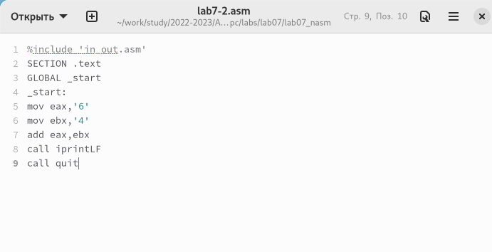

---
## Front matter
title: "Отчёт по лабораторной работе №7"
subtitle: "Дисциплина: Архитектура компьютера"
author: "Алиева Милена Арифовна"

## Generic otions
lang: ru-RU
toc-title: "Содержание"

## Bibliography
bibliography: bib/cite.bib
csl: pandoc/csl/gost-r-7-0-5-2008-numeric.csl

## Pdf output format
toc: true # Table of contents
toc-depth: 2
lof: true # List of figures
lot: true # List of tables
fontsize: 12pt
linestretch: 1.5
papersize: a4
documentclass: scrreprt
## I18n polyglossia
polyglossia-lang:
  name: russian
  options:
	- spelling=modern
	- babelshorthands=true
polyglossia-otherlangs:
  name: english
## I18n babel
babel-lang: russian
babel-otherlangs: english
## Fonts
mainfont: PT Serif
romanfont: PT Serif
sansfont: PT Sans
monofont: PT Mono
mainfontoptions: Ligatures=TeX
romanfontoptions: Ligatures=TeX
sansfontoptions: Ligatures=TeX,Scale=MatchLowercase
monofontoptions: Scale=MatchLowercase,Scale=0.9
## Biblatex
biblatex: true
biblio-style: "gost-numeric"
biblatexoptions:
  - parentracker=true
  - backend=biber
  - hyperref=auto
  - language=auto
  - autolang=other*
  - citestyle=gost-numeric
## Pandoc-crossref LaTeX customization
figureTitle: "Рис."
tableTitle: "Таблица"
listingTitle: "Листинг"
lofTitle: "Список иллюстраций"
lotTitle: "Список таблиц"
lolTitle: "Листинги"
## Misc options
indent: true
header-includes:
  - \usepackage{indentfirst}
  - \usepackage{float} # keep figures where there are in the text
  - \floatplacement{figure}{H} # keep figures where there are in the text
---

# Цель работы

Освоение арифметических инструкций языка ассемблера NASM.

# Задание

1. Символьные и численные данные в NASM
2. Выполнение арифметических операций в NASM
3. Задание для самостоятельной работы

# Теоретическое введение

Большинство инструкций на языке ассемблера требуют обработки операндов. Адрес операнда предоставляет место, где хранятся данные, подлежащие обработке. Это могут быть данные хранящиеся в регистре или в ячейке памяти.

Регистровая адресация – операнды хранятся в регистрах и в команде используются имена этих регистров, например: mov ax,bx.

Непосредственная адресация – значение операнда задается непосредственно в команде, Например: mov ax,2.

Адресация памяти – операнд задает адрес в памяти. В команде указывается символическое обозначение ячейки памяти, над содержимым которой требуется выполнить операцию.

Довольно часто при написании программ встречается операция прибавления или вычитания единицы. Прибавление единицы называется инкрементом, а вычитание — декрементом. Для этих операций существуют специальные команды: inc (от англ. increment) и dec (от англ. decrement), которые увеличивают
и уменьшают на 1 свой операнд.

Команда neg рассматривает свой операнд как число со знаком и меняет знак операнда на противоположный. Операндом может быть регистр или ячейка памяти любого размера.

# Выполнение лабораторной работы

1. Создаю каталог для программам лабораторной работы № 7, перейхожу в
него и создаю файл lab7-1.asm: (рис. [-@fig:001])

{ #fig:001 width=70% }

2. Открываю файл lab7-1.asm и вставляю в него программу вывода значений, записанных в регистр eax (рис. [-@fig:002])

{ #fig:002 width=70% }

3. Создаю исполняемый файл и запускаю его, предварительно добавив в каталог подключаемый файл in_out.asm. Результатом будет символ j. Это происходит потому, что код символа 6 равен 00110110 в двоичном представлении, , а код символа 4 – 00110100. Команда add eax,ebx запишет в регистр eax сумму кодов – 01101010 (106 в десятичном представлении), что в свою очередь является кодом символа j по таблице АSCII (рис. [-@fig:003])

{ #fig:003 width=70% }

4. Заменяю в тексте программы символы "6" и "4" на цифры 6 и 4(рис. [-@fig:004])

{ #fig:004 width=70% }

5. Создаю новый исполняемый файл программы и запускаю его. Результатом является пустой вывод(так как вывелся символ с кодом 10, а это символ перевода строки, этот символ не отображается при выводе на экран (рис. [-@fig:005])

{ #fig:005 width=70% }

6. Создаю файл lab7-2.asm с помощью утилиты touch. Ввожу в файл текст программы для вывода значения регистра eax (рис. [-@fig:006]) 

{ #fig:006 width=70% }

7. Создаю исполняемый файл и запускаю его. Результатом является число 106(это происходит потому что программа позволяет вывести именно число, а не символ, хотя все еще происходит именно сложение кодов символов "6" и "4") (рис. [-@fig:007])

{ #fig:007 width=70% }

8. Заменяю в тексте программы в файле lab7-2.asm символы "6" и "4" на числа 6 и 4 (рис. [-@fig:008])

{ #fig:008 width=70% }

9. Создаю исполняемый файл и запускаю его. Результатом является число 106(это происходит потому что теперь программа складывает не соответствующие символам коды в системе ASCII, а сами числа, поэтому вывод 10)(рис. [-@fig:009])

{ #fig:009 width=70% }

10. Заменяю в тексте программы функцию iprintLF на iprint. Создаю исполняемый файл и запускаю его. Результатом является исчезновение переноса строки (рис. [-@fig:010]) 

{ #fig:010 width=70% }

11. Создаю файл lab7-3.asm с помощью утилиты touch. Ввожу в созданный файл текст программы для вычисления значения выражения f(x) = (5 * 2 + 3)/3. Создаю исполняемый файл и запускаю его. Получаю корректный результат (рис. [-@fig:011])

{ #fig:011 width=70% }

12. Изменяю программу так, чтобы она вычисляла значение выражения f(x) = (4 * 6 + 2)/5 (рис. [-@fig:012])

{ #fig:012 width=70% }

13. Создаю исполняемый файл и запускаю его. Вывод результата и остатка от деления. Программа отработала верно (рис. [-@fig:013]) 

{ #fig:013 width=70% }

14. Создаю файл variant.asm с помощью утилиты touch. Ввожу в файл текст программы для вычисления варианта задания по номеру студенческого билета (рис. [-@fig:014])

{ #fig:014 width=70% }

Ответы на вопросы: 

1) За вывод на экран сообщения ‘Ваш вариант:’ отвечают строки
mov eax,rem
call sprint

2) mov ecx, x используется, чтобы положить адрес вводимой строки x в регистр ecx mov edx.
mov edx, 80 - запись в регистр edx длины вводимой строки 
call sread - вызов подпрограммы из внешнего файла, обеспечивающей ввод сообщения с клавиатуры

3) Инструкция call atoi используется для вызова подпрограммы из внешнего файла, которая преобразует ascii-код символа в целое число и записывает результат в регистр eax

4) За вычисление варианта отвечают строки 
xor edx,edx
mov ebx,20
div ebx
inc edx

5) Остаток от деления при выполнении инструкции “div ebx” записывается в регистр  edx

6) Инструкция “inc edx” используется для увеличения значения регистра edx на 1

7) За вывод на экран результата вычислений отвечают строки
mov eax,edx
call iprintLF

15. Создаю исполняемый файл и запускаю его. Получаю номер варианта, при проверке всё сходится (рис. [-@fig:015])

{ #fig:015 width=70% }

16. Приступаю к выполнению заданий для самостоятельной работы. 
Создаю файл lab7-4.asm с помощью утилиты touch. Открываю созданный файл для редактирования, ввожу в него текст программы для вычисления значения выражения под номером 10: (x + 18) * 5 - 28 (рис. [-@fig:016])

{ #fig:016 width=70% }

17. Создаю исполняемый файл и запускаю его. При вводе x = 2 получаю ответ 72, при вводе x = 3 получаю ответ 77. Делаю проверку вручную. Оба полученных значения являются корректными (рис. [-@fig:017])

{ #fig:017 width=70% }

# Выводы

При выполнении лабораторной работы освоила арифметические инструкции языка ассемблера NASM.

# Список литературы{.unnumbered}

::: {#refs}
:::
